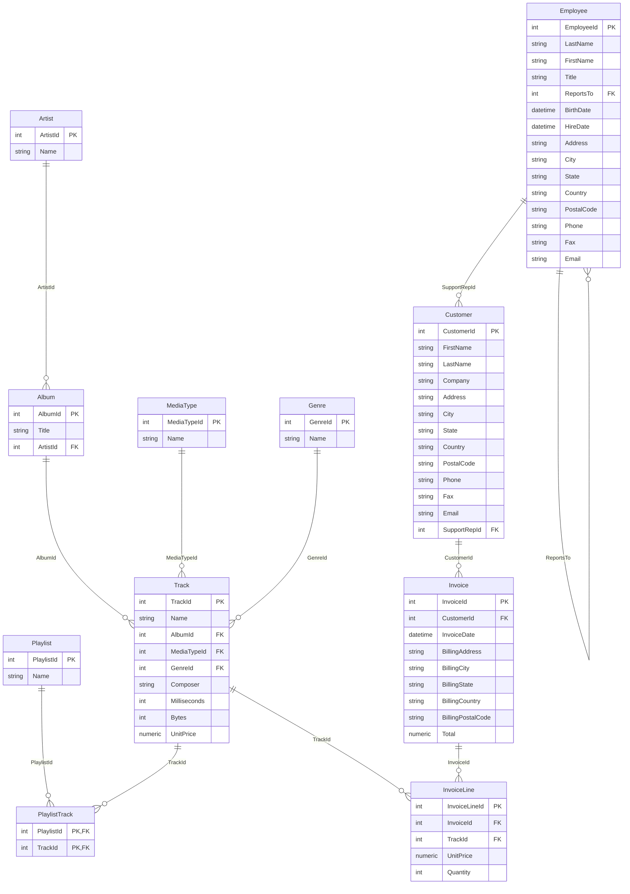

<div align="center">
  <h1>📊 SQL Roadmap</h1>
  <p>
    <strong>A structured, multi-dialect Zero-to-Hero SQL learning path</strong>
  </p>
  <p>
    <a href="https://github.com/umanggoel21/sql-roadmap/commits/main">
      
    </a>
    <a href="https://www.postgresql.org/">
      
    </a>
    <a href="https://github.com/umanggoel21/sql-roadmap/blob/main/LICENSE">
      
    </a>
  </p>
</div>

<br/>

## 📖 Overview

A **6-phase SQL curriculum** designed to take you from absolute zero to job-ready for Data Analytics and Engineering. 

All practical learning phases (Phase 2 to 5) and the Final Showcase Project run against the **Chinook Database**—a premium, industry-standard digital media store schema already packaged natively in the root of this repository as `Chinook_Sqlite.sqlite`. You can connect, run, and experiment with queries **instantly out-of-the-box** without loading complex DDL or seed scripts!

---

## 📑 Table of Contents

- [📖 Overview](#-overview)
- [🚀 Getting Started](#-getting-started)
- [📚 Phase 1 — Foundations](#-phase-1--foundations)
- [📚 Phase 2 — Core Querying](#-phase-2--core-querying)
- [📚 Phase 3 — Aggregations](#-phase-3--aggregations)
- [📚 Phase 4 — Joins](#-phase-4--joins)
- [📚 Phase 5 — Advanced SQL](#-phase-5--advanced-sql)
- [📚 Phase 6 — Industry Skills](#-phase-6--industry-skills)
- [🎓 Final Project — Case Studies](#-final-project--case-studies)
- [🧩 LeetCode Practice](#-leetcode-practice)
- [⚠️ Common Mistakes](#️-common-mistakes)
- [⚙️ Dialect Differences](#️-dialect-differences)
- [🤝 Contributing](#-contributing)

---

## 🚀 Getting Started

### Step 1 — Clone the Repository
```bash
git clone https://github.com/umanggoel21/sql-roadmap.git
cd sql-roadmap
```

### Step 2 — Open the Database
No complex setup is needed. We recommend **DBeaver** (free, cross-platform database tool):
1. Download & open [DBeaver Community](https://dbeaver.io/download/).
2. Click **Database → New Connection** and select **SQLite**.
3. In the path field, click browse and select the `Chinook_Sqlite.sqlite` file in the root of your cloned repository.
4. Click **Finish**. You are ready to open SQL Editor and start querying!

### Step 3 — Verify Your Connection
Run this test query to ensure everything is working:
```sql
SELECT 'Customer' AS TableName, COUNT(*) FROM Customer
UNION ALL
SELECT 'Track',                  COUNT(*) FROM Track
UNION ALL
SELECT 'Invoice',                COUNT(*) FROM Invoice;
-- Expected Row Counts: Customer: 59, Track: 3503, Invoice: 412
```

### 📊 Chinook Database ER Diagram

Below is the complete database structure you'll be working with. Hover over tables or relationships to see keys and cardinality!



---

## 📚 Phase 1 — Foundations
> Source files: [`phase1_foundations/`](./phase1_foundations)

Before writing queries, understand the *why* behind them.
- What is a relational database — tables, rows, columns, keys
- The Chinook Database Playground — understanding the schema
- **SQL execution order** — the most misunderstood concept for beginners

**→ [Read Phase 1 README](./phase1_foundations/README.md)**

---

## 📚 Phase 2 — Core Querying
> Source files: [`phase2_core_querying/`](./phase2_core_querying)

### Day 1 — SELECT Basics
```sql
SELECT * FROM Customer;
SELECT FirstName, LastName, Email FROM Customer;
SELECT COUNT(CustomerId) AS TotalCustomers FROM Customer;
SELECT Name, UnitPrice FROM Track LIMIT 10;
```

### Day 2 — DISTINCT & NULL Logic
```sql
SELECT DISTINCT Country FROM Customer;
SELECT CustomerId, Company FROM Customer WHERE Company IS NULL;
SELECT CustomerId, Company FROM Customer WHERE Company IS NOT NULL;
```

### Day 3 — Comparison Filters
```sql
SELECT TrackId, Name, UnitPrice FROM Track WHERE UnitPrice > 0.99;
SELECT CustomerId, Country FROM Customer WHERE Country = 'USA';
SELECT InvoiceId, Total, BillingCountry FROM Invoice WHERE BillingCountry <> 'USA';
```

### Day 4 — AND, OR, NOT & Precedence
```sql
SELECT TrackId, Name, UnitPrice, GenreId
FROM Track
WHERE (GenreId = 1 OR GenreId = 2) AND UnitPrice < 1.00;
```

### Day 5 — BETWEEN & IN
```sql
SELECT TrackId, Name, UnitPrice FROM Track WHERE UnitPrice BETWEEN 0.99 AND 1.99;
SELECT CustomerId, FirstName, Country FROM Customer WHERE Country IN ('Germany', 'France', 'United Kingdom');
```

### Day 6 — LIKE Patterns
```sql
SELECT CustomerId, Email FROM Customer WHERE Email LIKE '%@yahoo.com';
SELECT TrackId, Name FROM Track WHERE Name LIKE 'Love%';
```

### Day 7 — Phase 2 Practice
Combine concepts into practical customer and catalogue audits. ([Solutions](./phase2_core_querying/day07_practice.sql))

---

## 📚 Phase 3 — Aggregations
> Source files: [`phase3_aggregations/`](./phase3_aggregations)

### Day 8 — ORDER BY
```sql
SELECT Country, LastName, FirstName FROM Customer ORDER BY Country ASC, LastName DESC;
SELECT TrackId, Name, UnitPrice FROM Track ORDER BY UnitPrice DESC;
```

### Day 9 — LIMIT & OFFSET (Pagination)
```sql
SELECT Name, UnitPrice FROM Track ORDER BY TrackId ASC LIMIT 5 OFFSET 5;
```

### Day 10 — COALESCE & Null Handling
```sql
SELECT CustomerId, FirstName, COALESCE(Company, 'Individual') AS CustomerType FROM Customer;
```

### Day 11 — COUNT, SUM, AVG
```sql
SELECT COUNT(Country) AS ActiveCountryRecords FROM Customer;
SELECT SUM(Total) AS LifetimeTotalSales FROM Invoice;
SELECT AVG(Total) AS AverageInvoiceValue FROM Invoice;
```

### Day 12 — MIN & MAX
```sql
SELECT MIN(UnitPrice) AS CheapestItem, MAX(UnitPrice) AS FlagshipItem FROM Track;
SELECT MIN(InvoiceDate) AS FirstSale, MAX(InvoiceDate) AS RecentSale FROM Invoice;
```

### Day 13 — Aliases (AS)
```sql
SELECT CustomerId, (FirstName || ' ' || LastName) AS FullName FROM Customer;
```

### Day 14 — Phase 3 Practice
Sales summary dashboards, paginated list outputs, and address audits. ([Solutions](./phase3_aggregations/day14_practice.sql))

---

## 📚 Phase 4 — Joins
> Source files: [`phase4_joins/`](./phase4_joins)

### Day 15 — GROUP BY
```sql
SELECT Country, COUNT(CustomerId) AS CustomerCount FROM Customer GROUP BY Country ORDER BY CustomerCount DESC;
```

### Day 16 — HAVING
```sql
SELECT Country, COUNT(CustomerId) AS CustomerCount FROM Customer GROUP BY Country HAVING COUNT(CustomerId) > 4;
```

### Day 17 — Multi-Column Grouping
```sql
SELECT Country, State, COUNT(CustomerId) FROM Customer WHERE State IS NOT NULL GROUP BY Country, State;
```

### Day 18 — INNER JOIN
```sql
SELECT i.InvoiceId, i.Total, c.FirstName, c.LastName
FROM Invoice i INNER JOIN Customer c ON i.CustomerId = c.CustomerId;

-- Chain 3 tables
SELECT il.InvoiceLineId, t.Name AS TrackName, il.UnitPrice
FROM InvoiceLine il
INNER JOIN Invoice i ON il.InvoiceId = i.InvoiceId
INNER JOIN Track t ON il.TrackId = t.TrackId;
```

### Day 19 — LEFT JOIN
```sql
SELECT c.CustomerId, c.FirstName, c.LastName
FROM Customer c LEFT JOIN Invoice i ON c.CustomerId = i.CustomerId
WHERE i.InvoiceId IS NULL;
```

### Day 20 — SELF JOIN
```sql
SELECT emp.FirstName || ' ' || emp.LastName AS Employee,
       mgr.FirstName || ' ' || mgr.LastName AS Manager
FROM Employee emp
LEFT JOIN Employee mgr ON emp.ReportsTo = mgr.EmployeeId;
```

### Day 21 — Phase 4 Practice
Genre revenue performance, self-referencing reporting directories, and catalog coverage. ([Solutions](./phase4_joins/day21_practice.sql))

---

## 📚 Phase 5 — Advanced SQL
> Source files: [`phase5_advanced/`](./phase5_advanced)

### Day 22 — Subqueries
```sql
-- WHERE subquery
SELECT InvoiceId, Total FROM Invoice WHERE Total > (SELECT AVG(Total) FROM Invoice);

-- Correlated subquery
SELECT c.CustomerId, c.Email,
       (SELECT MAX(i.InvoiceDate) FROM Invoice i WHERE i.CustomerId = c.CustomerId) AS LastInvoice
FROM Customer c;
```

### Day 23 — EXISTS & NOT EXISTS
```sql
SELECT c.CustomerId, c.Email FROM Customer c
WHERE EXISTS (SELECT 1 FROM Invoice i WHERE i.CustomerId = c.CustomerId AND i.Total > 15.00);
```

### Day 24 — UNION & UNION ALL
```sql
SELECT 'Employee' AS Role, FirstName, LastName, Email FROM Employee
UNION
SELECT 'Customer' AS Role, FirstName, LastName, Email FROM Customer;
```

### Day 25 — CASE WHEN
```sql
SELECT Name AS TrackName, UnitPrice,
       CASE 
           WHEN UnitPrice < 0.99 THEN 'Budget'
           WHEN UnitPrice = 0.99 THEN 'Standard'
           ELSE 'Premium'
       END AS PriceTier
FROM Track;
```

### Day 26 — Date Functions
```sql
SELECT InvoiceId, STRFTIME('%Y', InvoiceDate) AS InvoiceYear FROM Invoice;
```

### Day 27 — Window Functions
```sql
-- Partition rankings
SELECT Name AS TrackName, GenreId, UnitPrice,
       ROW_NUMBER() OVER (PARTITION BY GenreId ORDER BY UnitPrice DESC) AS GenrePriceRank
FROM Track;
```

### Day 28 — Phase 5 Practice
Customer segmentation models, and the second-most-expensive track inside each genre. ([Solutions](./phase5_advanced/day28_practice.sql))

---

## 📚 Phase 6 — Industry Skills
> Source files: [`phase6_industry/`](./phase6_industry)

What separates a learner from a hireable analyst:

| File | Topic |
|------|-------|
| `01_indexes_and_explain.sql` | Indexes + reading EXPLAIN plans |
| `02_views.sql` | CREATE VIEW vs CTE — when to use what |
| `03_transactions.sql` | BEGIN / COMMIT / ROLLBACK |
| `04_schema_design.sql` | 1NF/2NF/3NF normalization + Star Schema |
| `05_data_quality.sql` | Find duplicates, orphans, NULLs |
| `06_interview_patterns.sql` | Cohort, retention, funnel, MoM, rolling avg |

**→ [Read Phase 6 README](./phase6_industry/README.md)**

---

## 🎓 Final Project — Case Studies
> Source files: [`final_project/`](./final_project)

### Case Study 1: Cohort Spending CLV by Country
```sql
SELECT c.Country, COUNT(DISTINCT c.CustomerId) AS Customers, SUM(i.Total) AS Revenue,
       SUM(i.Total) / COUNT(DISTINCT c.CustomerId) AS CLV
FROM Customer c INNER JOIN Invoice i ON c.CustomerId = i.CustomerId
GROUP BY c.Country ORDER BY Revenue DESC;
```

### Case Study 2: Month-over-Month Revenue Growth Velocity
```sql
WITH Monthly AS (
    SELECT STRFTIME('%Y-%m', InvoiceDate) AS Period, SUM(Total) AS Revenue
    FROM Invoice GROUP BY Period
)
SELECT Period, Revenue,
       LAG(Revenue) OVER (ORDER BY Period) AS PrevRevenue,
       Revenue - LAG(Revenue) OVER (ORDER BY Period) AS NetGrowth
FROM Monthly;
```

---

## 🧩 LeetCode Practice
> Source files: [`leetcode/`](./leetcode)

Problems are tagged by phase so you practice each concept right after learning it.

**→ [View LeetCode Problem Index](./leetcode/README.md)**

---

## ⚠️ Common Mistakes

These are the most frequent errors. Full details in [`notes/common_mistakes.md`](./notes/common_mistakes.md).

| Mistake | Wrong | Right | Why |
| :--- | :--- | :--- | :--- |
| NULL comparison | `WHERE col = NULL` | `WHERE col IS NULL` | `= NULL` evaluates to UNKNOWN, not TRUE |
| Precedence | `A OR B AND C` | `(A OR B) AND C` | `AND` binds tighter than `OR` |
| Aggregate filter | `WHERE COUNT(*) > 5` | `HAVING COUNT(*) > 5` | `WHERE` runs before grouping |
| String quotes | `WHERE col = "text"` | `WHERE col = 'text'` | Double quotes = identifiers, single quotes = values |

---

## ⚙️ Dialect Differences

| Feature | SQLite | PostgreSQL | MySQL | SQL Server |
| :--- | :--- | :--- | :--- | :--- |
| **Null Fallback** | `COALESCE` / `IFNULL` | `COALESCE` | `COALESCE` / `IFNULL` | `COALESCE` / `ISNULL` |
| **Pagination** | `LIMIT x OFFSET y` | `LIMIT x OFFSET y` | `LIMIT y, x` | `OFFSET y ROWS FETCH NEXT x` |
| **Year from Date** | `STRFTIME('%Y', d)` | `EXTRACT(YEAR FROM d)` | `YEAR(d)` | `DATEPART(year, d)` |
| **Concatenation** | `col1 \|\| col2` | `col1 \|\| col2` | `CONCAT(col1, col2)` | `col1 + col2` |

Full reference: [`notes/quick_reference.md`](./notes/quick_reference.md)

---

## 📓 Notes & Reference

| File | Contents |
|------|----------|
| [`notes/common_mistakes.md`](./notes/common_mistakes.md) | 10 most common SQL errors |
| [`notes/quick_reference.md`](./notes/quick_reference.md) | Multi-dialect syntax cheat sheet |
| [`notes/execution_order.md`](./notes/execution_order.md) | Complete execution order guide with alias gotchas |
| [`notes/interview_patterns.md`](./notes/interview_patterns.md) | 20 most common DA interview patterns |

---

## 🤝 Contributing

Contributions are welcome — fixing typos, adding dialect coverage, or new exercises.

1. Fork the repo
2. Create a branch (`git checkout -b feature/window-functions`)
3. Commit your changes
4. Open a Pull Request

---

## 📄 License

MIT License. See `LICENSE` for details.
