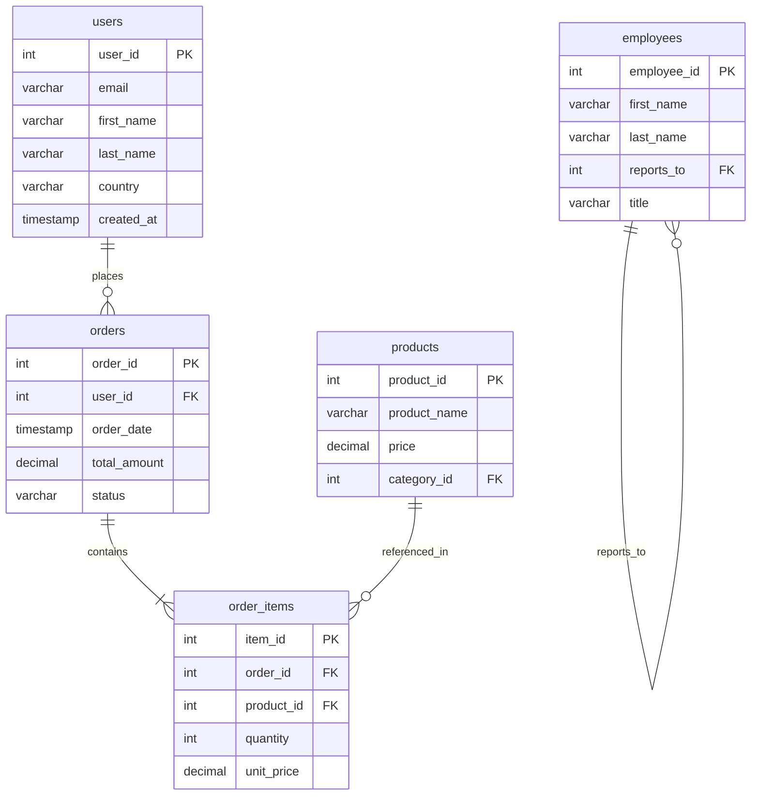

<div align="center">
  <h1>📊 SQL Roadmap</h1>
  <p>
    <strong>A structured, multi-dialect Zero-to-Hero SQL learning path</strong>
  </p>
  <p>
    <a href="https://github.com/umanggoel21/sql-roadmap/commits/main">
      
    </a>
    <a href="https://www.postgresql.org/">
      
    </a>
    <a href="https://github.com/umanggoel21/sql-roadmap/blob/main/LICENSE">
      
    </a>
  </p>
</div>

<br/>

## 📖 Overview

This is a **30-day SQL curriculum** that takes you from writing your first `SELECT` to building analytical reports with window functions and CTEs. All examples use a universal E-Commerce schema and include dialect notes for **PostgreSQL, MySQL, SQLite, SQL Server, and BigQuery** where syntax differs.

---

## 📑 Table of Contents

- [📖 Overview](#-overview)
- [🗄️ Schema](#️-schema)
- [📅 Week 1 — Foundations](#-week-1--foundations)
- [📅 Week 2 — Aggregations](#-week-2--aggregations)
- [📅 Week 3 — Joins & Grouping](#-week-3--joins--grouping)
- [📅 Week 4 — Advanced SQL](#-week-4--advanced-sql)
- [🎓 Final Project — Case Studies](#-final-project--case-studies)
- [⚠️ Common Mistakes](#️-common-mistakes)
- [⚙️ Dialect Differences](#️-dialect-differences)
- [🚀 Getting Started](#-getting-started)
- [🤝 Contributing](#-contributing)

---

## 🗄️ Schema

Every query in this roadmap runs against a single, consistent E-Commerce schema:



**Tables at a glance:** `users` (customers), `orders` (transactions), `products` (catalog), `order_items` (line items), `employees` (staff with self-referencing hierarchy).

---

## 📅 Week 1 — Foundations
> Source files: [`week1/`](./week1)

### Day 1 — SELECT Basics
Retrieve data from tables. Select all columns, specific columns, count rows, and limit output.
```sql
SELECT * FROM users;
SELECT first_name, email FROM users;
SELECT COUNT(user_id) AS total_users FROM users;
SELECT product_name FROM products LIMIT 10;
```

### Day 2 — DISTINCT & NULL Logic
Extract unique values and understand three-valued logic. `NULL` is not a value — it means "unknown."
```sql
SELECT DISTINCT country FROM users;
SELECT user_id, email FROM users WHERE country IS NULL;
SELECT user_id, email FROM users WHERE country IS NOT NULL;
```
> **Rule:** Never write `WHERE col = NULL`. It always returns zero rows. Use `IS NULL`.

### Day 3 — Comparison Filters
Filter rows using `=`, `<>`, `>`, `<`, `>=`, `<=`.
```sql
SELECT product_name, price FROM products WHERE price > 100.00;
SELECT user_id, country FROM users WHERE country = 'USA';
SELECT order_id, status FROM orders WHERE status <> 'Completed';
```

### Day 4 — AND, OR, NOT & Precedence
Combine conditions. `AND` executes before `OR` — always use parentheses to be explicit.
```sql
-- Without parentheses: this does NOT do what you'd expect
SELECT * FROM products WHERE category_id = 1 OR category_id = 2 AND price < 50;

-- Correct: group the OR condition
SELECT * FROM products WHERE (category_id = 1 OR category_id = 2) AND price < 50;
```

### Day 5 — BETWEEN & IN
Simplify range checks and list matching.
```sql
SELECT * FROM products WHERE price BETWEEN 10.00 AND 50.00;
SELECT * FROM users WHERE country IN ('Germany', 'France', 'Italy');
```

### Day 6 — LIKE Patterns
Match strings using `%` (any characters) and `_` (one character).
```sql
SELECT email FROM users WHERE email LIKE '%@gmail.com';
SELECT product_name FROM products WHERE product_name LIKE 'Super%';
```

### Day 7 — Week 1 Practice
Combine everything learned into multi-condition business queries. ([Solutions](./week1/day07_practice.sql))

---

## 📅 Week 2 — Aggregations
> Source files: [`week2/`](./week2)

### Day 8 — ORDER BY
Sort results by one or more columns, ascending or descending.
```sql
SELECT country, email FROM users ORDER BY country ASC, email DESC;
SELECT product_name, price FROM products ORDER BY price DESC;
```

### Day 9 — LIMIT & OFFSET (Pagination)
Page through results. Syntax varies by dialect.
```sql
-- PostgreSQL, MySQL, SQLite, BigQuery
SELECT product_name, price FROM products ORDER BY price DESC LIMIT 5 OFFSET 5;

-- SQL Server (T-SQL)
-- SELECT product_name, price FROM products ORDER BY price DESC
-- OFFSET 5 ROWS FETCH NEXT 5 ROWS ONLY;
```

### Day 10 — COALESCE & Null Handling
Replace NULL values with fallback defaults.
```sql
SELECT user_id, COALESCE(country, 'Not Provided') AS shipping_country FROM users;
```
> **Dialect note:** MySQL/SQLite also support `IFNULL()`. T-SQL uses `ISNULL()`.

### Day 11 — COUNT, SUM, AVG
Aggregate math across rows.
```sql
SELECT COUNT(user_id) AS total_users FROM users;
SELECT SUM(total_amount) AS lifetime_revenue FROM orders;
SELECT AVG(total_amount) AS avg_order_value FROM orders;
```

### Day 12 — MIN & MAX
Find boundary values.
```sql
SELECT MIN(price) AS cheapest, MAX(price) AS most_expensive FROM products;
SELECT MIN(order_date) AS first_order, MAX(order_date) AS latest_order FROM orders;
```

### Day 13 — Aliases (AS)
Give columns readable names. Format calculated outputs.
```sql
SELECT user_id, (first_name || ' ' || last_name) AS full_name FROM users;
SELECT SUM(total_amount) AS revenue, COUNT(order_id) AS orders FROM orders;
```

### Day 14 — Week 2 Practice
Pagination ranking, financial summaries, null-replacement reports. ([Solutions](./week2/day14_practice.sql))

---

## 📅 Week 3 — Joins & Grouping
> Source files: [`week3/`](./week3)

### Day 15 — GROUP BY
Bucket rows into categories and aggregate each group.
```sql
SELECT country, COUNT(user_id) AS user_count
FROM users GROUP BY country ORDER BY user_count DESC;
```

### Day 16 — HAVING
Filter groups after aggregation. `WHERE` filters rows. `HAVING` filters groups.
```sql
SELECT country, COUNT(user_id) AS user_count
FROM users GROUP BY country HAVING COUNT(user_id) > 50;
```

### Day 17 — Multi-Column Grouping
Group by multiple dimensions at once.
```sql
SELECT order_date, status, COUNT(order_id) AS volume
FROM orders GROUP BY order_date, status;
```

### Day 18 — INNER JOIN
Link rows across tables where keys match. Unmatched rows are excluded.
```sql
SELECT o.order_id, o.total_amount, u.first_name, u.email
FROM orders o
INNER JOIN users u ON o.user_id = u.user_id;

-- Chain 3 tables
SELECT oi.item_id, p.product_name, oi.quantity
FROM order_items oi
INNER JOIN orders o ON oi.order_id = o.order_id
INNER JOIN products p ON oi.product_id = p.product_id;
```

### Day 19 — LEFT JOIN
Keep all rows from the left table. Unmatched right-side rows become NULL. Great for finding "missing" data.
```sql
-- Find users who have never ordered
SELECT u.user_id, u.email
FROM users u
LEFT JOIN orders o ON u.user_id = o.user_id
WHERE o.order_id IS NULL;
```

### Day 20 — SELF JOIN
Join a table to itself. Used for hierarchies like org charts.
```sql
SELECT emp.first_name AS employee, mgr.first_name AS manager
FROM employees emp
LEFT JOIN employees mgr ON emp.reports_to = mgr.employee_id;
```

### Day 21 — Week 3 Practice
Revenue by category, inactive products, active buyer cohorts. ([Solutions](./week3/day21_practice.sql))

---

## 📅 Week 4 — Advanced SQL
> Source files: [`week4/`](./week4)

### Day 22 — Subqueries
Nest a query inside another query. Can appear in `WHERE`, `SELECT`, or `FROM`.
```sql
-- WHERE subquery: orders above average
SELECT order_id, total_amount FROM orders
WHERE total_amount > (SELECT AVG(total_amount) FROM orders);

-- Correlated subquery: each user's last order date
SELECT u.user_id, u.email,
       (SELECT MAX(o.order_date) FROM orders o WHERE o.user_id = u.user_id) AS last_order
FROM users u;
```

### Day 23 — EXISTS & NOT EXISTS
Check whether matching rows exist. Faster than `IN` for large datasets because it short-circuits.
```sql
-- Users with at least one high-value order
SELECT u.user_id, u.email FROM users u
WHERE EXISTS (SELECT 1 FROM orders o WHERE o.user_id = u.user_id AND o.total_amount > 500);

-- Products never sold
SELECT p.product_name FROM products p
WHERE NOT EXISTS (SELECT 1 FROM order_items oi WHERE oi.product_id = p.product_id);
```

### Day 24 — UNION & UNION ALL
Stack result sets vertically. `UNION` removes duplicates. `UNION ALL` keeps everything (faster).
```sql
SELECT 'Employee' AS role, first_name, email FROM employees
UNION
SELECT 'Customer' AS role, first_name, email FROM users;
```

### Day 25 — CASE WHEN
Add conditional logic inside queries. Works for row-level labels and pivoting aggregations.
```sql
SELECT product_name, price,
       CASE
           WHEN price < 20 THEN 'Budget'
           WHEN price BETWEEN 20 AND 100 THEN 'Mid-Range'
           ELSE 'Premium'
       END AS tier
FROM products;

-- Conditional aggregation (pivot)
SELECT country,
       COUNT(CASE WHEN o.status = 'Completed' THEN 1 END) AS completed,
       COUNT(CASE WHEN o.status = 'Pending' THEN 1 END) AS pending
FROM users u INNER JOIN orders o ON u.user_id = o.user_id
GROUP BY country;
```

### Day 26 — Date Functions
Extract parts of dates. Syntax varies heavily by dialect.
```sql
-- SQLite
SELECT STRFTIME('%Y', order_date) AS year, SUM(total_amount) AS revenue
FROM orders GROUP BY year;

-- PostgreSQL / BigQuery: EXTRACT(YEAR FROM order_date)
-- MySQL: YEAR(order_date)
-- T-SQL: DATEPART(year, order_date)
```

### Day 27 — Window Functions
Perform calculations across rows without collapsing them (unlike `GROUP BY`).
```sql
-- Rank products by price within each category
SELECT product_name, category_id, price,
       ROW_NUMBER() OVER (PARTITION BY category_id ORDER BY price DESC) AS rank
FROM products;

-- Running total
SELECT order_id, total_amount,
       SUM(total_amount) OVER (ORDER BY order_date) AS running_total
FROM orders;
```

### Day 28 — Week 4 Practice
Customer lifetime tiers (Platinum/Gold/Silver), second-most-expensive product per category using CTEs. ([Solutions](./week4/day28_practice.sql))

---

## 🎓 Final Project — Case Studies
> Source files: [`final_project/`](./final_project)

### Case Study 1: Customer Lifetime Value by Country
```sql
SELECT u.country, COUNT(DISTINCT u.user_id) AS users, SUM(o.total_amount) AS revenue,
       SUM(o.total_amount) / COUNT(DISTINCT u.user_id) AS avg_clv
FROM users u INNER JOIN orders o ON u.user_id = o.user_id
GROUP BY u.country ORDER BY revenue DESC;
```

### Case Study 2: Month-over-Month Revenue Growth
```sql
WITH monthly AS (
    SELECT STRFTIME('%Y-%m', order_date) AS period,
           SUM(total_amount) AS revenue
    FROM orders GROUP BY period
)
SELECT period, revenue,
       LAG(revenue) OVER (ORDER BY period) AS prev_month,
       revenue - LAG(revenue) OVER (ORDER BY period) AS growth
FROM monthly;
```

### Case Study 3: Product Performance Tiers
```sql
SELECT p.product_name, SUM(oi.quantity) AS units_sold,
       CASE
           WHEN SUM(oi.quantity) >= 100 THEN 'Top Seller'
           WHEN SUM(oi.quantity) BETWEEN 20 AND 99 THEN 'Steady'
           ELSE 'Slow Moving'
       END AS tier
FROM products p LEFT JOIN order_items oi ON p.product_id = oi.product_id
GROUP BY p.product_name ORDER BY units_sold DESC;
```

---

## ⚠️ Common Mistakes

These are the most frequent errors. Full details in [`notes/common_mistakes.md`](./notes/common_mistakes.md).

| Mistake | Wrong | Right | Why |
| :--- | :--- | :--- | :--- |
| NULL comparison | `WHERE col = NULL` | `WHERE col IS NULL` | `= NULL` evaluates to UNKNOWN, not TRUE |
| Precedence | `A OR B AND C` | `(A OR B) AND C` | `AND` binds tighter than `OR` |
| Aggregate filter | `WHERE COUNT(*) > 5` | `HAVING COUNT(*) > 5` | `WHERE` runs before grouping |
| String quotes | `WHERE col = "text"` | `WHERE col = 'text'` | Double quotes = identifiers, single quotes = values |

---

## ⚙️ Dialect Differences

| Feature | PostgreSQL | MySQL | BigQuery | SQL Server |
| :--- | :--- | :--- | :--- | :--- |
| **Null Fallback** | `COALESCE` | `IFNULL` | `IFNULL` | `ISNULL` |
| **Pagination** | `LIMIT x OFFSET y` | `LIMIT y, x` | `LIMIT x OFFSET y` | `OFFSET y ROWS FETCH NEXT x` |
| **Year from Date** | `EXTRACT(YEAR FROM d)` | `YEAR(d)` | `EXTRACT(YEAR FROM d)` | `DATEPART(year, d)` |
| **Concatenation** | `col1 \|\| col2` | `CONCAT(col1, col2)` | `CONCAT(col1, col2)` | `col1 + col2` |

Full reference: [`notes/quick_reference.md`](./notes/quick_reference.md)

---

## 🚀 Getting Started

**You need:** Any SQL client ([DBeaver](https://dbeaver.io/), [DataGrip](https://www.jetbrains.com/datagrip/), or a terminal) and a database (PostgreSQL, MySQL, or even a local SQLite file).

```bash
git clone https://github.com/umanggoel21/sql-roadmap.git
cd sql-roadmap
```
Open any `.sql` file from the weekly folders and run it against your database.

---

## 🤝 Contributing

Contributions are welcome — fixing typos, adding dialect coverage, or new exercises.

1. Fork the repo
2. Create a branch (`git checkout -b feature/window-functions`)
3. Commit your changes
4. Open a Pull Request

---

## 📄 License

MIT License. See `LICENSE` for details.
