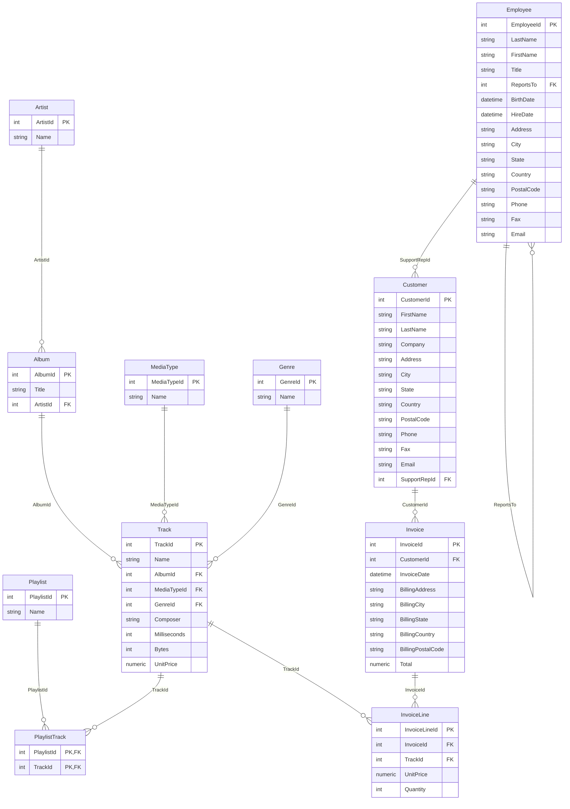

# Phase 1 — Foundations

> **Before you write a single query, you need to understand *what* you're querying.**  
> This phase answers the "why" before the "how".

---

## 1.1 What is a Relational Database?

A **relational database** stores data in **tables** (also called *relations*).  
Each table has:

| Concept | Meaning | Example |
|---------|---------|---------|
| **Column** | A field / attribute | `Email`, `UnitPrice`, `InvoiceDate` |
| **Row** | A single record | One customer, one track |
| **Primary Key (PK)** | Uniquely identifies each row | `CustomerId`, `TrackId` |
| **Foreign Key (FK)** | Links one table to another | `Invoice.CustomerId` → `Customer.CustomerId` |

### Why "relational"?
Because tables **relate** to each other through keys.  
`Invoice` knows *who* placed it via `CustomerId`. That FK is what makes JOINs possible.

---

## 1.2 The Chinook Schema (Your Playground)

All practical queries in this roadmap run against the **Chinook Database**, a standard and highly popular real-world relational database representing a digital media store (artists, albums, tracks, customers, invoices).

The schema is already packaged in the root of the repository as a self-contained SQLite file: `Chinook_Sqlite.sqlite`.

### Table Descriptions:

```
Customer      → Who bought (customers, addresses, and support rep mappings)
Employee      → Who works (employee list, titles, and self-referencing reporting manager)
Track         → What is sold (tracks, music attributes, price, and media formats)
Genre         → Music genres (Rock, Jazz, Metal, etc.)
Album         → Music albums and artist mappings
Artist        → Music artists
Invoice       → Purchase events (invoices, dates, billing locations, and grand totals)
InvoiceLine   → Line items inside each invoice (connecting tracks and quantities)
```

### Table Relationships (ER Diagram)



---

## 1.3 Setup & Running Queries Instantly

Because this repository packages `Chinook_Sqlite.sqlite` natively, you can open and run all queries instantly without loading any DDL or seed scripts!

### Option A — DBeaver (Recommended GUI)

1. Download [DBeaver Community](https://dbeaver.io/download/)
2. Create a new connection: **Database → New Database Connection**
3. Choose **SQLite**
4. Under "Path", browse to your cloned folder and select `Chinook_Sqlite.sqlite`
5. Click **Finish**. You are ready to open SQL Editor and write queries!

### Option B — SQLite CLI

If you have SQLite installed:
```bash
sqlite3 Chinook_Sqlite.sqlite
```

---

## 1.4 SQL Execution Order

This is the **most misunderstood concept** for beginners.  
SQL is *written* in one order but *executed* in a completely different order:

```
Writing order:              Execution order:
─────────────               ────────────────
SELECT   ◄── 6th            1. FROM          ← which table(s)?
FROM     ◄── 1st            2. JOIN          ← combine tables
JOIN     ◄── 2nd            3. WHERE         ← filter rows
WHERE    ◄── 3rd            4. GROUP BY      ← group rows
GROUP BY ◄── 4th            5. HAVING        ← filter groups
HAVING   ◄── 5th            6. SELECT        ← pick columns
ORDER BY ◄── 7th            7. ORDER BY      ← sort results
LIMIT    ◄── 8th            8. LIMIT/OFFSET  ← pagination
```

### Why does this matter?

```sql
-- ❌ This BREAKS — alias defined in SELECT, used in WHERE
SELECT Total * 0.08 AS Tax
FROM Invoice
WHERE Tax > 1.00;          -- ERROR: column "Tax" does not exist
-- WHERE runs BEFORE SELECT, so the alias doesn't exist yet!

-- ✅ This WORKS — use the full expression in WHERE
SELECT Total * 0.08 AS Tax
FROM Invoice
WHERE Total * 0.08 > 1.00;

-- ✅ OR wrap it in a subquery / CTE
SELECT *
FROM (
    SELECT Total * 0.08 AS Tax
    FROM Invoice
) sub
WHERE Tax > 1.00;
```

> 🔑 **Memorize this:** You cannot use a SELECT alias in WHERE or HAVING.  
> You CAN use it in ORDER BY (most databases allow this as a convenience).

---

## 1.5 Your First Queries — Verify the Connection

Open your connection in DBeaver or SQLite CLI and run these to confirm you can read the Chinook schema:

```sql
-- Count rows in the primary tables
SELECT 'Customer' AS TableName, COUNT(*) FROM Customer
UNION ALL
SELECT 'Track',                  COUNT(*) FROM Track
UNION ALL
SELECT 'Invoice',                COUNT(*) FROM Invoice;
-- Expected: 59, 3503, 412

-- Peek at 5 rows from Track
SELECT TrackId, Name, UnitPrice FROM Track LIMIT 5;
```

---

## What's Next?

Once your database is connected and you can run the verification queries above, move to:

**→ [Phase 2 — Core Querying](../phase2_core_querying/README.md)**

You'll learn SELECT, WHERE, filtering, sorting, and more — all using this same Chinook schema.
